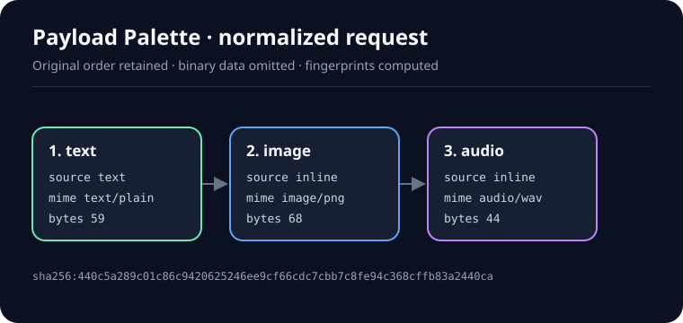

# Payload Palette

**A dependency-free Python toolkit for validating and normalizing ordered multimodal request payloads before they reach a model server.**

[](https://www.python.org/)
[](LICENSE)
[](https://github.com/appleweiping/payload-palette/actions/workflows/ci.yml)
[](https://github.com/appleweiping/payload-palette/actions/workflows/codeql.yml)

Multimodal endpoints often receive a mixture of text, images, audio, and video. The same media may arrive as a data URL, bare Base64, or remote URL, while each transport has different failure and security modes. Payload Palette turns those variations into one deterministic manifest without fetching remote resources or retaining inline binary data.



The visualization above is generated from [`examples/request.json`](examples/request.json). Its exact machine-readable result is checked in as [`examples/manifest.json`](examples/manifest.json) and verified in CI.

## Why use it?

A model adapter should not also have to answer all of these questions:

- Did decoding 14 MB of Base64 silently create a 10 MB image or a 200 MB input?
- Does an `image_url` point to an approved public host, localhost, or a URL containing credentials?
- Does a claimed `image/jpeg` payload begin with a PNG signature?
- Did normalization reorder a prompt's image and text parts?
- Can logs correlate repeated content without recording binary media or signed URL queries?
- Can an API return a stable error code and the most specific available source JSON path?

Payload Palette establishes that boundary once. It is useful at API ingress, before queueing work, in offline dataset checks, and in tests for model-specific adapters.

## Features

- Preserves the original order of `text`, `image`, `audio`, and `video` parts.
- Accepts a direct content array, a `{ "content": [...] }` envelope, a single typed part, or `messages[].content` arrays.
- Reads Anthropic Messages, Google Gemini `generateContent`, and Ollama envelopes through opt-in
  adapters that the caller names. A vendor shape is never detected from the document.
- Supports base64 data URLs and strict padded or unpadded standard Base64, with encoded-length and
  whitespace-amplification bounds before allocation and decoding.
- Accepts RFC 4648 section 5 URL-safe Base64 only when explicitly enabled, and always rejects a
  payload that mixes the two alphabets.
- Decodes inline Base64 in bounded 64 KiB blocks and folds each block into a size, digest, and
  signature prefix, so peak memory no longer grows with the decoded payload.
- Decodes JSON incrementally on request without buffering the complete raw body. Ordinary request
  structure and accepted text are still materialized, while long media strings become bounded
  summaries. Peak memory then follows the retained structure rather than media size: measured on
  one inline PNG, the same 1.5 MB whether the image is 1 MiB or 32 MiB.
- Bounds data URL headers before parameter parsing and checks MIME policy before Base64 decoding.
- Rejects duplicate JSON keys, non-standard numeric constants, excessive nesting, and isolated
  Unicode surrogates.
- Rejects remote URLs by default. Exact hosts and explicit subdomain wildcards can be allowlisted.
- Caps each remote URL at 16,384 characters before URL parsing or canonicalization.
- Never performs DNS resolution, HTTP requests, file reads from payload values, or media transcoding.
- Enforces allowed MIME types, per-kind decoded sizes, total inline size, text length, and part count.
- Bounds CLI input bytes before JSON parsing and applies hard ceilings to configurable policies.
- Compares recognizable PNG, JPEG, GIF, WebP, WAV, MP3, Ogg, FLAC, MP4, and WebM signatures to declarations.
- Produces SHA-256 fingerprints for every part and the complete ordered manifest.
- Removes inline binary content and redacts remote URL queries in manifest output by default.
- Returns structured errors with stable codes, JSON paths, messages, and optional remediation hints.
- Writes manifest files through same-directory atomic replacement and reports stdout failures cleanly.
- Includes a typed Python API and `validate` / `normalize` CLI commands.
- Provides `normalize_batch()` / `normalize_jsonl()` for bounded offline
  dataset audits and `manifest_schema()` for versioned manifest interchange.
- Has no runtime dependencies.

## Installation

Payload Palette requires Python 3.11 or later.

Install from a checkout:

```bash
git clone https://github.com/appleweiping/payload-palette.git
cd payload-palette
python -m venv .venv
source .venv/bin/activate  # Windows PowerShell: .venv\Scripts\Activate.ps1
python -m pip install .
```

For development tools, use the `dev` extra instead:

```bash
python -m pip install -e ".[dev]"
```

## Quick start

Validate the included request:

```bash
payload-palette validate examples/request.json
```

```json
{
  "valid": true,
  "fingerprint": "sha256:440c5a289c01c86c9420625246ee9cf66cdc7cbb7c8fe94c368cffb83a2440ca",
  "part_count": 3,
  "inline_bytes": 171
}
```

Write the normalized manifest:

```bash
payload-palette normalize examples/request.json -o manifest.json
```

Standard input and output are supported with `-`:

```bash
echo '[{"type":"text","text":"hello"}]' | payload-palette normalize - --compact
```

## Accepted input contract

The parser deliberately accepts a compact set of representations rather than guessing arbitrary vendor schemas.

| Kind | Accepted type values | Primary value | Notes |
|---|---|---|---|
| Text | `text`, `input_text` | `text` string | UTF-8 byte length and character count are recorded. |
| Image | `image`, `input_image`, `image_url` | `data`, `image_base64`, or `image_url.url` | Bare Base64 needs a MIME type or known `format`. |
| Audio | `audio`, `input_audio`, `audio_url` | `data`, `input_audio.data`, or `audio_url.url` | `input_audio.format` maps common labels such as `wav` and `mp3`. |
| Video | `video`, `input_video`, `video_url` | `data`, `video_base64`, or `video_url.url` | Remote content remains an unfetched reference. |

Inline media uses the standard Base64 alphabet. Payloads from JWT-adjacent and URL contexts that use the RFC 4648 section 5 `-`/`_` alphabet are rejected with `url_safe_base64_disabled` unless `allow_url_safe_base64` is enabled; a payload containing characters from both alphabets is always rejected with `mixed_base64_alphabet` because no conforming encoder produces one.

MIME declarations can use `mime_type` or `media_type`. Data URLs carry their own MIME declaration; a conflicting outer declaration is rejected. Safe presentation metadata currently retains only string `detail` and `name` fields. Unknown fields are ignored rather than copied into the manifest.

Raw JSON must follow the standard grammar: duplicate object keys, `NaN`, and positive or negative
`Infinity` are rejected. Equivalent aliases may be repeated only when their MIME declarations agree;
multiple media value fields or incompatible root envelope fields are rejected as ambiguous. Strings
may contain any Unicode scalar value, but isolated UTF-16 surrogate code points are rejected. Text
fingerprints cover exact UTF-8 bytes—Payload Palette intentionally does not apply NFC/NFKC or other
semantic text normalization.

### Envelope adapters

The table above describes the default contract. Three further request shapes are supported, but only
when the caller names one through `NormalizationPolicy(envelope=...)` or `--envelope`. A vendor shape
is never inferred from the document, because guessing would weaken the deliberate
`ambiguous_envelope` rejection. An adapter translates shape only: part order, per-kind size caps,
MIME policy, signature checks, and the remote-URL default-deny apply exactly as they do by default,
and every issue still reports the precise source path of the value that failed.

| `envelope` | Root | Text | Inline media | Remote reference |
|---|---|---|---|---|
| `default` | array, `content`, `messages`, or one typed part | `text`, `input_text` | `data`, `*_base64`, data URL | `image_url`, `audio_url`, `video_url` |
| `anthropic` | `messages[]` | `content` string or `{"type": "text"}` | `{"type": "image", "source": {"type": "base64", "media_type": …, "data": …}}` | `source.type` of `url` |
| `gemini` | `contents[].parts[]` | `{"text": …}` | `{"inline_data": {"mime_type": …, "data": …}}` | `{"file_data": {"mime_type": …, "file_uri": …}}` |
| `ollama` | `prompt` with sibling `images`, or `messages[]` with `content` and sibling `images` | `prompt` or `content` string | each `images[]` entry | none |

Deliberate refusals:

- Anthropic `source.type: "file"` is rejected with `unsupported_source`. A Files API `file_id` is
  neither inline bytes nor a locator, so nothing about it can be validated without fetching.
- Gemini parts are read as the snake_case fields the REST reference documents. A part must carry
  exactly one of `text`, `inline_data`, or `file_data`; `function_call`, `thought`, and an empty part
  are `unsupported_part`. `mime_type` is required on both media containers—without it the part kind
  is unknowable—and its major type must be `image`, `audio`, or `video`, so `application/pdf` is
  `unsupported_media_kind`. A relative Files API URI such as `files/abc123` is not an HTTP(S) locator
  and fails with `url_scheme`.
- Content blocks that are neither text nor media, such as `tool_use`, `tool_result`, and `thinking`,
  are rejected rather than skipped.
- Ollama declares no media type anywhere in its envelope, so the decoded container signature becomes
  the media type. An image whose leading bytes match no supported signature is rejected with
  `undeclared_media_type`, and a derived type must still pass the image MIME allowlist. An Ollama
  image is never a locator: a URL placed in `images[]` fails as invalid Base64.

Ordering deserves an explicit note. Ollama associates images with their text positionally instead of
interleaving them, so the payload states no order between the two. The adapter fixes one and records
it here: the text first, then each `images` entry in array order, per prompt and per chat message.
Manifest ordinals therefore reflect that documented rule rather than an ordering the request itself
expressed, and JSON key order is never consulted. Every other adapter preserves the order the payload
really states.

### Example request

```json
{
  "messages": [
    {
      "role": "user",
      "content": [
        {"type": "text", "text": "What is shown?"},
        {
          "type": "image_url",
          "image_url": {"url": "data:image/png;base64,iVBORw0K..."},
          "detail": "high"
        },
        {
          "type": "input_audio",
          "input_audio": {"data": "UklGRiQ...", "format": "wav"}
        }
      ]
    }
  ]
}
```

The result contains parts with ordinals `0`, `1`, and `2` in exactly that order.

## CLI reference

### `validate`

Checks a request and prints a short JSON summary:

```bash
payload-palette validate REQUEST.json
payload-palette validate - --json-errors
```

Exit code `0` means valid. Validation and JSON/input errors use exit code `2`. With `--json-errors`, failures are written as a structured JSON envelope to standard error.

### `normalize`

Validates and emits the canonical manifest:

```bash
payload-palette normalize REQUEST.json
payload-palette normalize REQUEST.json --compact
payload-palette normalize REQUEST.json --output MANIFEST.json
```

### Policy options

Both commands accept:

| Option | Meaning |
|---|---|
| `--allow-host cdn.example.org` | Allow one exact HTTPS host; repeat as needed. |
| `--allow-host '*.example.org'` | Allow subdomains, but not the apex `example.org`. Quote wildcards in a shell. |
| `--allow-http` | Permit HTTP for already allowlisted hosts. HTTPS remains the default. |
| `--keep-url-query` | Include query strings in output. The safer default displays `[redacted]`. |
| `--max-parts N` | Override the default 128-part limit. |
| `--max-total-bytes N` | Override the 128 MiB total decoded inline budget. |
| `--max-input-bytes N` | Bound UTF-8 JSON before parsing; defaults to 192 MiB with a 512 MiB hard ceiling. |
| `--no-signature-check` | Disable best-effort signature comparison; MIME allowlists still apply. |
| `--allow-url-safe-base64` | Also accept the URL-safe `-`/`_` Base64 alphabet. Standard-only is the default. |
| `--envelope NAME` | Read `default`, `anthropic`, `gemini`, or `ollama` request shapes. Never auto-detected. |
| `--stream` | Decode incrementally; large encoded strings are summarized, while ordinary structure and accepted text remain materialized. |

Allowlisting only validates a reference. Payload Palette never downloads it:

```bash
payload-palette validate request.json --allow-host media.example.org
```

## Python API

```python
import json
from pathlib import Path

from payload_palette import NormalizationPolicy, RemoteURLPolicy, normalize

document = json.loads(Path("request.json").read_text(encoding="utf-8"))
policy = NormalizationPolicy(
    max_parts=32,
    max_total_inline_bytes=32 * 1024 * 1024,
    remote=RemoteURLPolicy(allowed_hosts=("media.example.org", "*.assets.example.org")),
)

manifest = normalize(document, policy)
print(manifest.fingerprint)
print(manifest.to_dict())
```

This example assumes `request.json` is already trusted JSON. A decoded Python object cannot retain
evidence of duplicate object keys, so applications accepting raw untrusted JSON must use a strict,
byte-bounded decoder with the same duplicate-key, number, depth, and Unicode rules as the CLI.
For an HTTP body that is already available as bytes, use the shared ingress decoder instead:

```python
from payload_palette import normalize_json_bytes

manifest = normalize_json_bytes(raw_request_body, max_input_bytes=48 * 1024 * 1024)
```

The reverse proxy and HTTP server must enforce an equal or smaller limit before buffering the body.

When the body is large enough that buffering it is the problem, read it as a stream instead. The
manifest is identical; what changes is that no copy of the media is ever held:

```python
from payload_palette import normalize_stream

with open("request.json", "rb") as handle:
    manifest = normalize_stream(handle, policy)
```

`decode_stream` returns the decoded document alongside a `StreamStatistics` record, so an operator
can assert on what a run actually retained rather than trust a claim about it:

```python
from payload_palette import decode_stream

document, statistics = decode_stream(handle, policy)
print(statistics.streamed_media_bytes, statistics.peak_retained_characters)
```

A string longer than the streaming threshold arrives as a `LargeValue`: its true length, its leading
characters, and the media summary computed while it streamed past. Such a value is still usable as
inline media and is refused as anything else for the reason it would have been refused anyway. See
[docs/streaming.md](docs/streaming.md).
See the [API ingress integration boundary](docs/ingress-integration.md) and its
[machine-readable security policy matrix](benchmarks/security_policy_matrix.json).

For non-exception control flow, `validate` returns a tuple of issues:

```python
from payload_palette import validate

issues = validate([{"type": "image", "data": "%%%", "mime_type": "image/png"}])
for issue in issues:
    print(issue.code, issue.path, issue.message)
```

To read another vendor's request shape, name it—`NormalizationPolicy(envelope="anthropic")`,
`"gemini"`, or `"ollama"`. `ENVELOPE_NAMES` lists every accepted value and an unknown one is a
`ValueError`. The selection is part of the policy, so `normalize`, `validate`, and
`normalize_json_bytes` all honour it without a separate argument:

```python
from payload_palette import NormalizationPolicy, normalize

manifest = normalize(anthropic_request, NormalizationPolicy(envelope="anthropic"))
```

Custom per-kind size and MIME mappings can be passed to `NormalizationPolicy`; the `text` MIME rule
applies to the fixed `text/plain` representation as well. `NormalizationPolicy(allow_url_safe_base64=True)`
additionally accepts URL-safe inline Base64; it stays disabled by default so a payload cannot silently
switch alphabets. Limits must be real
Python integers—not booleans, floats, `NaN`, or infinity—and stay within the hard ceilings exported
from `payload_palette.policy`. Mapping keys are checked exactly, MIME values must already be
normalized, and all mappings are copied into immutable views so caller mutation cannot change a
running policy.

## Validate structured model output

Complete JSON generated by a model can be checked separately from multimodal request ingress.
`OutputSchema` describes strict nested JSON types and field constraints. `ValidationPipeline`
runs trusted synchronous `OutputValidator.check(value, context)` callbacks on isolated field
copies, returning structured `RuleOutcome` records and accepted output in an `OutputReport`.

```python
from payload_palette import OutputSchema, RuleBinding, TrimmedString, ValidationPipeline

pipeline = ValidationPipeline(
    OutputSchema(
        "object", properties={"label": OutputSchema("string", min_length=1)}, required=("label",)
    ),
    rules=(RuleBinding("trim_label", ("label",), TrimmedString(), on_fail="fix"),),
)
report = pipeline.validate_json_bytes(b'{"label":" bicycle "}')
assert report.valid
assert report.output == {"label": "bicycle"}
```

`reject` records a failure, `fix` checks a proposed replacement, and `filter` removes an optional
object member. The resulting document must pass the schema and every applicable rule again after
changes. Required fields cannot disappear through filtering; failed runs expose no accepted output.
`OutputLimits` bounds JSON depth, node/character counts, issue aggregation, and callback invocations.
Callbacks are trusted Python code and run synchronously; this API cannot interrupt a callback's
CPU work or network access.

Run `python examples/validate_model_output.py` for a complete classification example with repairs,
optional-field filtering, and per-field diagnostics. Read the
[structured output contract](docs/output-validation.md) for ordering, limits, and exceptions, and the
[reference gap assessment](docs/parity-validation.md) for the remaining repository-level work.

For schema data interchange or trusted Python annotations, use `load_output_schema`,
`export_output_schema` and `AnnotationAdapter`. Supported types include constrained scalars,
nullable unions, lists, typed string-key maps, Literal and TypedDict. Unknown schema keywords,
unresolved annotation strings and recursive definitions are rejected explicitly. Configured JSON
serialization preserves accepted values with an exact output-byte cap. See the
[runtime schema/type contract](docs/runtime-schema-types.md) for integer semantics, supported
subsets and resource bounds, or run `python examples/runtime_schema_adapter.py`.

For generation, implement the asynchronous `AsyncModelProvider.generate(request)` protocol and
pass it to `AsyncGenerationRunner`. The runner validates each complete JSON response and provides
bounded field/code feedback for a new attempt when output is invalid. It applies shared attempt,
reported-token, response-byte, and validator-call budgets, with cooperative provider deadlines and
cancellation. No provider SDK, credentials, or network behavior is installed implicitly.

```bash
python examples/generate_validated_output.py
```

This executable offline example exercises an invalid classification, re-ask feedback, and a valid
second response. [The generation lifecycle contract](docs/generation.md) describes the adapter API,
privacy rules, cancellation behavior, and the distinction between reported usage and provider billing.

## Manifest format

### Comparing and auditing manifests

Cache layers can compare two normalized requests without diffing arbitrary JSON:

```python
from payload_palette import audit_manifest, compare_manifests, normalize

before = normalize([{"type": "text", "text": "hello"}])
after = normalize([{"type": "text", "text": "hello"}, {"type": "text", "text": "world"}])
change = compare_manifests(before, after)
print(change.append_compatible, change.changed_paths, change.added_ordinals)

# The audit receipt never retains text, inline bytes, or URL query/fragment data.
receipt = audit_manifest(after).to_dict()
```

`append_compatible` is true only when all existing ordinals are unchanged and new parts
are appended. This is a cache hint, not a statement that downstream model output will
be equivalent.

The top-level manifest contains:

- `schema_version`: currently `1.0`;
- `fingerprint`: SHA-256 of the canonical ordered part descriptions;
- `part_count` and `inline_bytes` resource summaries;
- `parts`: safe normalized entries in input order.

Each part records its input `path`, `kind`, source class, and fingerprint. Inline media records decoded byte length and MIME type but not Base64; its bytes are hashed and measured block by block and are never retained in full. Text is retained because it is the semantic prompt; applications that treat prompt text as sensitive should apply their own logging redaction before persisting manifests. A remote part contains a normalized locator but no claimed byte length because nothing was fetched. Manifest shells, every nested part, and attribute mappings are immutable snapshots; every `to_dict()` call revalidates that snapshot and returns a fresh mutable copy. Direct model construction accepts at most the policy hard ceiling of 1,000,000 parts and 64 presentation attributes per part, without trusting a custom container's reported length.

Fingerprints identify normalized byte equality; they are not authenticity proofs. Remote fingerprints
cover a deliberately scoped RFC 3986 canonical form, including any query that was redacted from
display. Canonicalization lowercases scheme/IDNA host, removes a trailing host dot and default port,
normalizes percent escapes and unreserved characters, removes dot segments, and discards fragments.
It does not reorder query parameters, decode reserved delimiters, or Unicode-normalize paths.
Manifest and CLI JSON writers explicitly forbid non-standard `NaN`/infinity output. Public model
integer fields are limited to 640 decimal digits, so their documented JSON form remains serializable
even when CPython uses its lowest configurable integer-conversion limit.

## Structured errors

Invalid input raises `PayloadValidationError`. Independent part failures are collected where possible:

```json
{
  "valid": false,
  "error_count": 1,
  "errors": [
    {
      "code": "remote_url_disabled",
      "message": "remote media references are disabled by policy",
      "path": "$.messages[0].content[1].image_url",
      "hint": "allow an exact host with --allow-host"
    }
  ]
}
```

Treat `code` as the stable machine-facing field. Message wording may improve between compatible releases.

## Security model

Payload Palette assumes the entire JSON document is untrusted.

### Defenses provided

- Base64 is checked for impossible length and estimated decoded size before allocation, then decoded strictly.
- Only one Base64 alphabet is accepted per payload, and the URL-safe alphabet requires an explicit
  opt-in that leaves every length, padding, MIME, and size rule unchanged.
- Inline decoding advances block by block and checks the running decoded total, so an oversized
  payload stops partway instead of being fully materialized first.
- Data URL headers are capped at 1,024 characters before parameter splitting; MIME denials and
  conflicting declarations fail before Base64 decoding.
- CLI file/stdin input is byte-bounded before parsing; JSON depth, integer digits, part collection,
  and structural-error aggregation are also bounded.
- Inline content is checked again after decoding and counted against a total request budget.
- Remote media is default-deny, requires HTTP(S), rejects URL credentials, and requires an exact allowlist match.
- Envelope adapters are opt-in and named by the caller. An adapter is a shape translation: it adds no
  new source class and relaxes no size, MIME, signature, or remote-URL rule.
- Literal loopback, private, link-local, multicast, reserved, unspecified, deprecated 6to4/6a44,
  and ambiguous legacy IPv4
  spellings are rejected consistently across supported Python versions. URL controls, whitespace,
  backslashes, IPv6 zone identifiers, malformed escapes, invalid host labels, and multiple trailing
  host dots are rejected before allowlist matching.
- URL fragments are removed and queries are redacted from output by default.
- Known binary signatures are compared with declared MIME types.
- Manifests omit inline media bytes and arbitrary input metadata.
- File outputs are fully written and synchronized in the destination directory before atomic
  replacement, so a failed write does not truncate an existing manifest.

### Boundaries and downstream duties

- Hostnames are not resolved. A later fetcher must defend against DNS rebinding and re-check every resolved address and redirect target.
- Accepted media is not fully parsed, decompressed, transcoded, or scanned for malware.
- Signature checks recognize common headers only; they do not prove a complete or valid file.
- Remote sizes and content MIME types cannot be confirmed without fetching.
- Text remains in the manifest and may contain secrets or personal data.
- The Ollama envelope declares no media type, so its images are classified from the decoded container
  signature. That one case checks the MIME allowlist after a decode, rather than before it. The
  decode is still bounded by the same per-kind image ceiling and pre-decode encoded-length check as
  any other inline image, so no additional work becomes reachable.
- SHA-256 fingerprints support correlation, not trust or authorization.

Do not use this library as the only control around a network fetcher or media decoder. See [SECURITY.md](SECURITY.md) for private reporting.

## Architecture

```text
JSON document
    │
    ▼
Envelope discovery ──► ordered part parsing ──► source classification
                                                    │
                      ┌─────────────────────────────┼─────────────────────────────┐
                      ▼                             ▼                             ▼
                 text limits              bounded inline decode          remote URL policy
                      │                             │                             │
                      └──────────► MIME / signature / resource checks ◄──────────┘
                                                    │
                                                    ▼
                                    deterministic binary-free manifest
```

The implementation separates external-shape parsing, media decoding, policy, and manifest construction so new adapters do not weaken core security rules. Read [docs/architecture.md](docs/architecture.md) for invariants, data flow, extension points, and threat analysis.

The same pipeline runs over a byte stream when the request is too large to hold. Read
[docs/streaming.md](docs/streaming.md) for how a long string becomes a measurement, what such a
value may still be used for, and the differential evidence that both paths answer alike.

## Reproduce the demo

The demo builder uses the public API and has no extra dependencies:

```bash
mkdir demo-output
python examples/build_demo.py --output-dir demo-output
```

It writes `manifest.json` and `demo.svg`. CI compares those files byte-for-byte with the checked-in assets, preventing screenshots or documentation from drifting away from executable behavior.

## Limitations and roadmap

Version 0.3 focuses on a small, auditable ingress contract. It does not fetch URLs, inspect full media containers, resolve local paths, mutate requests in place, or submit payloads to a model. URL-safe Base64 is converted only under an explicit opt-in. Inline Base64 is decoded in bounded blocks and its large encoded value need not be held in full on the streaming path. Ordinary request structure and accepted text are still materialized. `normalize_stream` and `--stream` apply the identical default-deny resource model and produce the identical manifest. Streaming remains opt-in, because the two paths can name different issue codes for a document that breaks more than one rule at once; [docs/streaming.md](docs/streaming.md) gives the worked example and the differential evidence. Opt-in adapters now read the Anthropic Messages, Google Gemini, and Ollama envelopes; a vendor shape is never detected from the document, so the caller always names the envelope.

The repository's benchmark inputs are synthetic and its timing results characterize only the
recorded machine. Read the [evaluation scope and research limitations](docs/research-limitations.md)
before citing measurements. Public API, manifest, CLI, error-code, and Python support expectations
are documented in the [compatibility policy](docs/compatibility.md).

## Reproducible benchmark

The dependency-free benchmark measures strict decode plus normalization for three deterministic
synthetic request shapes. It records Python, operating system, processor description, logical CPU
count, repeat count, latency distribution, throughput distribution, and `tracemalloc` peak memory:

```bash
python benchmarks/benchmark_ingress.py --repeats 7 --operations 250 \
  --output benchmark-results.json
```

This is a local characterization protocol, not a universal throughput claim. Keep the generated
JSON with deployment records and rerun it on the hardware and Python version being evaluated.
A [reference run](benchmarks/results/reference-windows-python314.json) is checked in with complete
environment and repeat metadata so the reporting schema and workload fingerprints are auditable.
The runner records the Payload Palette version, caps repeats at 100 and operations per repeat at
100,000, and atomically replaces an output file only after a complete synchronized write. Memory is
measured in a private `tracemalloc` session; a run is rejected without stopping or resetting tracing
when the caller already has `tracemalloc` active.

## Development

```bash
python -m pip install -e ".[dev]"
python -m ruff check .
python -m ruff format --check .
python -m pytest --cov=payload_palette --cov-branch
python benchmarks/benchmark_ingress.py --repeats 3 --operations 2
python -m build --no-isolation
```

Tests cover ordering, malformed envelopes, malformed Base64 and data URLs, MIME conflicts, decoded-size and aggregate budgets, URL allowlists, private addresses, query redaction, structured CLI failures, and reproducible manifests. Contributions are welcome; see [CONTRIBUTING.md](CONTRIBUTING.md), [GOVERNANCE.md](GOVERNANCE.md), the [release verification guide](docs/releases.md), and [citation metadata](CITATION.cff).

## Companion repositories

Payload Palette is one independent part of a small multimodal tooling suite. [Frame Quorum](https://github.com/appleweiping/frame-quorum) selects auditable key frames, [Evidence Braid](https://github.com/appleweiping/evidence-braid) fuses evidence under explicit policies, [Graph Sail](https://github.com/appleweiping/graph-sail) plans heterogeneous DAGs, and [Stream Quilt](https://github.com/appleweiping/stream-quilt) aligns event streams. The repositories have separate contracts and release cycles; no runtime dependency is implied.

## License

Payload Palette is available under the [MIT License](LICENSE).
